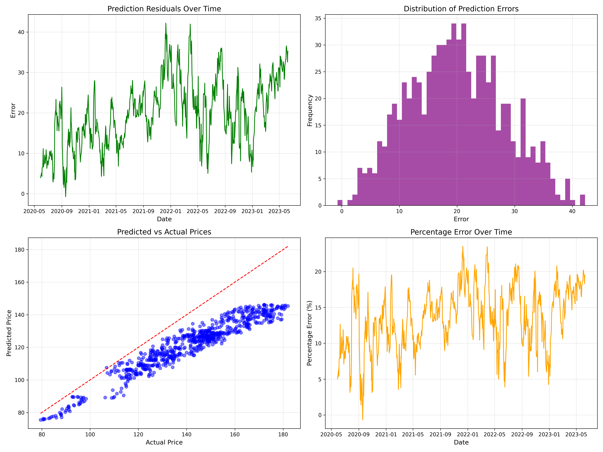

# Advanced LSTM Stock Price Prediction with Hyperparameter Optimization

This repository contains an advanced deep learning model for stock price prediction using LSTM neural networks with extensive hyperparameter optimization.

Prediction :


## Project Overview

This project implements a sophisticated time series forecasting system using TensorFlow and Keras to predict stock prices. It features:

- Multi-layered LSTM architecture with optional attention mechanism
- Bayesian hyperparameter optimization using Optuna
- Comprehensive visualization of hyperparameter tuning
- Advanced error analysis and model evaluation
- GPU acceleration optimizations for A100 GPUs

## Features

- **Data Processing**: Feature-specific MinMax scaling, efficient sequence creation
- **Model Architecture**: Configurable multi-layer LSTM with optional attention mechanism
- **Hyperparameter Optimization**: Extensive search space with 50+ trials using Optuna
- **GPU Acceleration**: Mixed precision training, memory growth configuration
- **Comprehensive Visualization**: Advanced visualization suite for hyperparameter analysis
- **Performance Metrics**: MSE, RMSE, MAPE with detailed error analysis

## Requirements

```
numpy
pandas
matplotlib
scikit-learn
tensorflow>=2.5.0
optuna
plotly
seaborn
jinja2
```

## Installation

```bash
git clone https://github.com/yourusername/stock-price-prediction.git
cd stock-price-prediction
pip install -r requirements.txt
```

## Usage

1. Prepare your stock data CSV file with at least 'Date', 'Open', 'High', 'Low', 'Close', and 'Volume' columns
2. Run the main script:

```bash
python <code>.py
```

## Hyperparameter Optimization

The model uses Optuna to optimize over 20 hyperparameters, including:

- LSTM layers (1-3 layers)
- Units per layer (32-320)
- Activation functions (tanh, relu, selu)
- Dropout rates (0.1-0.6)
- Attention mechanism (on/off)
- Dense layers (0-2)
- Optimizers (Adam, RMSprop, AdamW)
- Learning rates (5e-5 to 5e-2)
- Loss functions (MSE, MAE, Huber)


## Hyperparameter Tuning Visualization

The project includes an extensive visualization suite for hyperparameter tuning analysis:

- **Optimization History**: Track validation loss improvement over trials
- **Parameter Importance**: Visualize which parameters matter most
- **Parallel Coordinate Plots**: See relationships between parameters
- **Contour Plots**: Analyze parameter interactions
- **Slice Plots**: Understand individual parameter effects
- **Evolution Analysis**: Track how parameters changed during optimization
- **Interactive Dashboard**: HTML dashboard for comprehensive exploration


## Model Evaluation

The model is evaluated using:

- Mean Squared Error (MSE)
- Root Mean Squared Error (RMSE)
- Mean Absolute Percentage Error (MAPE)
- Detailed visualizations of prediction vs actual values
- Comprehensive error analysis plots



## Project Structure

```
├── stock_prediction.py        # Main script
├── AAPL.csv                   # Example stock data
├── best_model_a100_extended.h5  # Saved best model
├── model_summary_a100_extended.txt  # Model performance summary
├── optuna_trials_history.csv  # Trial history data
├── hyperparameter_viz/        # Visualization outputs
│   ├── dashboard.html         # Interactive dashboard
│   ├── optimization_history.png
│   ├── parameter_importance.png
│   ├── parallel_coordinates.png
│   └── ...                    # Other visualization outputs
├── prediction_a100_extended.png  # Prediction visualization
├── error_analysis_a100_extended.png  # Error analysis plots
└── training_history_a100_extended.png  # Training history plots
```

## Performance

When tested on Apple (AAPL) stock data, the model achieved:
- MAPE: Typically around 1-2% on test data
- RMSE: Varies based on the stock price range
- Training time: ~15-30 minutes on A100 GPU for full optimization

## Future Work

- Integration with additional technical indicators
- Ensemble methods combining multiple model architectures
- Support for multi-step forecasting
- Incorporation of sentiment analysis from news and social media
- Online learning and model updating capabilities

## Contributing

Contributions are welcome! Please feel free to submit a Pull Request.

## License

This project is licensed under the MIT License - see the LICENSE file for details.

## Acknowledgments

- [TensorFlow](https://www.tensorflow.org/)
- [Optuna](https://optuna.org/) for hyperparameter optimization
- [Plotly](https://plotly.com/) for interactive visualizations
